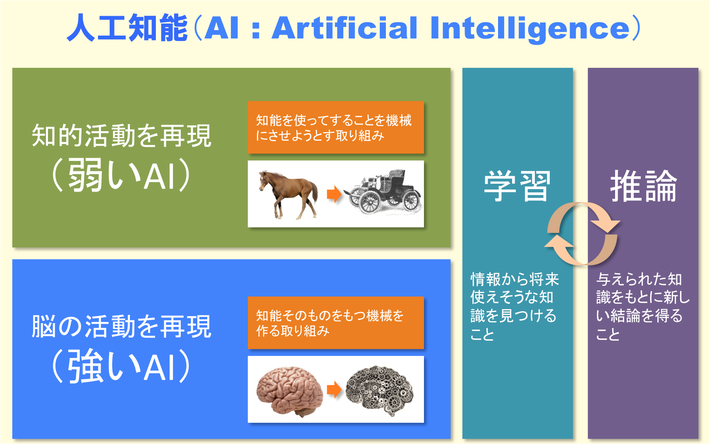
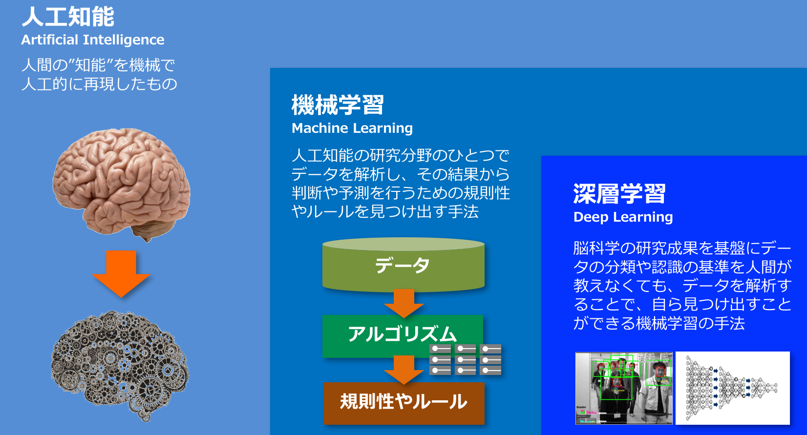
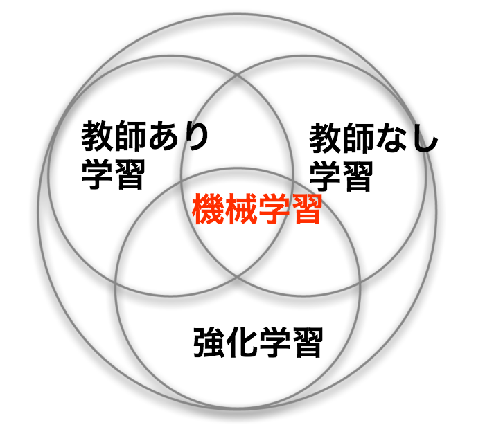

### 復讐して学ぶ「人工知能」
喜多村卓

---

### ＃１　〜人工知能って？？〜

---

### 目次

---

### 友達に「人工知能ってなに？」って、聞かれたらどう答える？？

- かしこいやつだよ！ |
- かっこいいやつだよ！ |
- すごいやつだよ！ |

- なんて、言わなくてもいいように、人工知能とはなにかを知ろう！！ |

---

### 人工知能（AI）とは

+++

### 「弱いAI」

人の思考の **一部** を再現する。

例をあげると、

人は、 **様々な思考の結果をもとに**

オセロをするのに対し、

弱いAIは、 **オセロに必要な思考のみをもとに**

オセロをする。

+++

つまり、弱いAIは、

**オセロをする人の思考を再現するのではなく**

**オセロをするのに必要な思考のみを再現し**

**オセロをする。**

+++

### 人工知能（AI）とは

+++

### 「強いAI」

人の思考の **全て** を再現する。

例をあげると、

人は、 **様々な思考の結果をもとに**

オセロをする。同様に、

強いAIも、 **様々な思考の結果をもとに**

オセロをする。

+++

つまり、強いAIは、

**オセロをする人の思考を全て再現し**

**オセロをする人と同じように、思考し**

**オセロをする。**

+++

### 人工知能（AI）とは

+++

### 「弱いAI」・「強いAI」の具体例

今までに、「弱いAI」は、実用化されきていた。

例えば、Appleの **Siri**, IBMの **Watson** など

理由は、「弱いAI」より、「強いAI」

のほうが作るのが難しかったから。

最近は、「強いAI」が実用化されてきた。

例えば、**画像認識**、**音声認識など**

+++

### 結局AIって何？？

AIとは

**人工的に作られた**

**人と同じように学び**

**考えるもの**

まさに、

人工的に作られた、知能

略して、 **人工知能** なのである。

---

### ＃２　〜人工知能はなにかわかった！
### 機械学習
### 深層学習（ディープラーニング）
### となにか違うの？？？〜

---

### 機械学習も、深層学習も人工知能も
### 同じじゃないの？？

- 機械学習は、人工知能の分野の手法の一種？？ |
- 深層学習は、機械学習の分野の手法の一種？？ |
- 深層学習は、人口知能の分野の手法の一種？？ |
- 全部正解！！！ |
- つまり、どうゆうこと？？ |

---

### 機械学習、深層学習の意味とは？？

+++

### 機械学習の概要

機械学習は、人工知能の分野の手法の一つで、

データを解析し、**データの規則性** を見つけ出す。

**人間が分類や認識の基準を決める必要がある**

（これは **「弱いAI」** に当たる）

機械学習と

**人間が分類や認識の基準を決める必要がない**

（これは **「強いAI」** に当たる）

深層学習がある。

+++

### 深層学習の概要

深層学習は、機械学習の分野の手法の一つで、

データを解析し、**データの規則性** を見つけ出す。

**人間が分類や認識の基準を決めなくても**

**自ら分類や認識の基準を決め**

データの規則性を見つけ出す。

これは、**「強いAI」** に当たる。

+++

### 機械学習の学習手法による分類

---

### おわり
