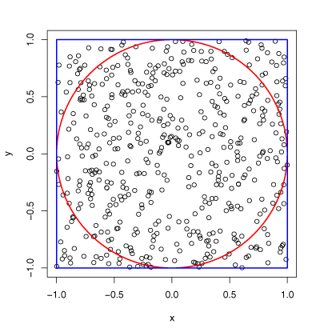
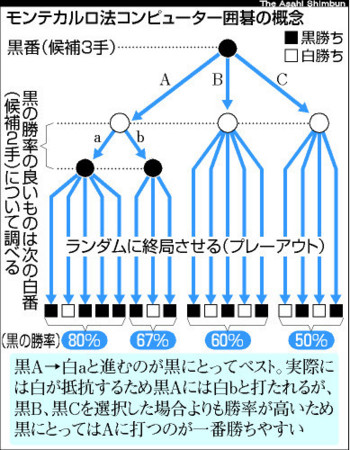
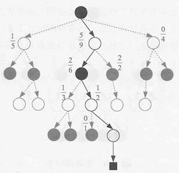

### 復習して学ぶ「人工知能」

---

### ＃１　〜人工知能って？？〜

---

### 目次

---

### 友達に「人工知能ってなに？」って、聞かれたらどう答える？？

- かしこいやつだよ！ |
- かっこいいやつだよ！ |
- すごいやつだよ！ |

- なんて、言わなくてもいいように、人工知能とはなにかを知ろう！！ |

---

### 人工知能（AI）とは

+++

### 「弱いAI」

人の思考の **一部** を再現する。

例をあげると、

人は、 **様々な思考の結果をもとに**

オセロをするのに対し、

弱いAIは、 **オセロに必要な思考のみをもとに**

オセロをする。

+++

つまり、弱いAIは、

**オセロをする人の思考を再現するのではなく**

**オセロをするのに必要な思考のみを再現し**

**オセロをする。**

+++

### 人工知能（AI）とは

+++

### 「強いAI」

人の思考の **全て** を再現する。

例をあげると、

人は、 **様々な思考の結果をもとに**

オセロをする。同様に、

強いAIも、 **様々な思考の結果をもとに**

オセロをする。

+++

つまり、強いAIは、

**オセロをする人の思考を全て再現し**

**オセロをする人と同じように、思考し**

**オセロをする。**

+++

### 人工知能（AI）とは

+++

### 「弱いAI」・「強いAI」の具体例

今までに、「弱いAI」は、実用化されきていた。

例えば、Appleの **Siri**, IBMの **Watson** など

理由は、「弱いAI」より、「強いAI」

のほうが作るのが難しかったから。

最近は、「強いAI」が実用化されてきた。

例えば、**画像認識**、**音声認識など**

+++

### 結局AIって何？？

AIとは

**人工的に作られた**

**人と同じように学び**

**考えるもの**

まさに、

人工的に作られた、知能

略して、 **人工知能** なのである。

---

### ＃２
### 〜機械学習
### 深層学習（ディープラーニング）
### となにか違うの？？？〜

---

### 機械学習も、深層学習も人工知能も
### 同じじゃないの？？

- 機械学習は、人工知能の分野の手法の一種？？ |
- 深層学習は、機械学習の分野の手法の一種？？ |
- 深層学習は、人口知能の分野の手法の一種？？ |
- 全部正解！！！ |
- つまり、どうゆうこと？？ |

---

### 機械学習、深層学習の意味とは？？

+++

### 機械学習の概要

機械学習は、人工知能の分野の手法の一つで、

データを解析し、**データの規則性** を見つけ出す。

**人間が分類や認識の基準を決める必要がある**

（これは **「弱いAI」** に当たる）

機械学習と

**人間が分類や認識の基準を決める必要がない**

（これは **「強いAI」** に当たる）

深層学習がある。

+++

### 深層学習の概要

深層学習は、機械学習の分野の手法の一つで、

データを解析し、**データの規則性** を見つけ出す。

**人間が分類や認識の基準を決めなくても**

**自ら分類や認識の基準を決め**

データの規則性を見つけ出す。

これは、**「強いAI」** に当たる。

+++

### 機械学習の学習手法による分類

+++

### 教師あり学習

- 企業の業績データを元に、未来の株価を予想する

- 手書きで書いた数字から、その数字を判定する

**入力データの特徴から**
**期待されるものを出力する**
**正解は存在する！**

+++

### 教師なし学習

- 迷惑メール、ビジネスメールの分類法を分析する

**入力データから、正解がない事象を推論、分析する**

**正解は存在しない！**

+++

### 強化学習

具体例

- コンピューターが囲碁をうまくできるようになる
- 歩き方を知らないロボットに歩く練習をさせ、歩かせる

**入力データから、期待されるものを出力するが**
**教師あり学習とは違い、入力に正解は与えられない**

+++

### 教師あり・なし・強化学習まとめ

- 機械学習は、大きく上記三つに分けられる
- 教師あり:正解をもとに、正解を探す
- 教師なし:正解がないものを元に、推定、分類
- 強化:正解ではないものをもとに、正解を探す

---

### ＃３　〜実践編:モンテカルロ法〜

---

### モンテカルロって？？？

ここが、モンテカルロ！行きたいですね！

---

### モンテカルロ法

**シュミレーションや数値計算を**

**乱数を用いて行う手法のこと**

+++

### $$\piをモンテカルロ法で求める$$

######$$(円の面積) = \pi r^2 = \pi(1.0)^2 = \pi $$
######$$(円の中の点の個数):(全部の点の個数) = $$
######$$(円の面積):(正方形の面積) = \pi:4$$
######$$\pi = 4*(円の中野店の個数)/(全部の点の個数)$$

+++

### モンテカルロ法で囲碁(強化学習)！

+++

### 強化学習でのモンテカルロ法の流れ

1. 可能な手から、一手選ぶ
2. 末端のノードを実行し、新たなノード作成
3. シュミレーションを1回行う
4. 辿って来たノードを更新する

+++

### モンテカルロ木探索

コンピュータ囲碁・モンテカルロ法の実践と理論・実践で学ぶ強化学習
松原仁 編、美添一樹、山下宏 著 共立出版 P27 図3.7より引用

+++

### どの手を選ぶか

###### $$\overline{x_j}=その手の勝率$$
###### $$C=任意の定数$$
###### $$n=全部の手の合計回数$$
###### $$n_j=その手を調べた回数$$

###### $$UCB=\overline{x_j}+C\sqrt{\log_e n/n_j}$$

+++

### モンテカルロ法まとめ

- モンテカルロ法は、現代の技術があるからこそ
- モンテカルロ法は、強化学習に応用化

---

### 参考文献

[1]人工知能・機械学習・ディープラーニングの関係
http://www.itmedia.co.jp/enterprise/articles/1608/31/news086.html

[2]UCL Course on RL Lecture 1: ntroduction to Reinforcement Learning
http://www0.cs.ucl.ac.uk/staff/d.silver/web/Teaching_files/intro_RL.pdf

[3]絶景はここにもあった！モナコ公国・モンテカルロで見るべき観光スポット6選
https://wondertrip.jp/europe/48122.html

+++

[4]朝日新聞・モンテカルロ法・コンピューター囲碁
http://f.hatena.ne.jp/gryphon/20090418081233

[5]モンテカルロ法
http://ito-hi.blog.so-net.ne.jp/2006-09-05

[6]統計的アプローチとディープ・ラーニング
http://blogs.itmedia.co.jp/itsolutionjuku/2015/04/post_73.html

+++

[5]コンピュータ囲碁・モンテカルロ法の実践と理論・実践で学ぶ強化学習
松原仁 編、美添一樹、山下宏 著 共立出版

[6]統計的学習の基礎・データマイニング・推論・予測
Trevor Hastie, Robert Tibshirani, Jerome Friedman 著
杉山 将、井手 剛、神嶌敏弘 翻訳 共立出版

[7]強くなるロボティック・ゲームプレイヤーの作り方
八谷大岳、杉山将 著 毎日コミュニケーションズ出版

---

### おわり
